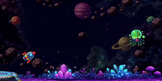

# Booooost

Booooost는 2D 우주 로켓 러닝 게임입니다.

## 🎮 게임 소개

플레이어는 로켓을 조작하여
장애물을 피하며 생존해야합니다!

## 🎮 조작 방법

- `A / D`, `좌,우 방향키` : 로켓 각도 조절
- `Space Bar`, `마우스 좌클릭`, `W`, `윗 방향키` : 앞으로 이동

---

## ☄ 장애물 종류

### ↔ Moving Enemy (Horizontal)
좌우로 이동하며 플레이어의 이동을 방해합니다.

### ↕ Moving Enemy (Vertical)
상하로 움직이며 경로를 차단합니다.

### 🔄 Orbit Enemy
원형 궤도로 회전하며 이동하는 적입니다.

### 🔫 Projectile Enemy
플레이어를 향해 투사체를 발사하는 적입니다.

### 💥 Suicide Enemy
플레이어 근처에서 자폭하는 적입니다.

### 👻 Stealth Enemy
일정 거리 내에서 투명화되는 적입니다.

---

## 🛠 개발 환경
- Unity 6
- C#
- Visual Studio Code
- GitHub

## 👨‍💻 개발자
- 한신대학교 윤은성